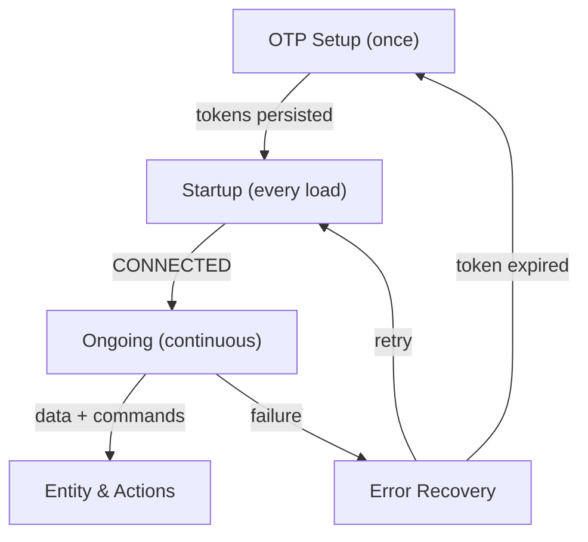

# Overview — How the Integration Serves HA Users

From a Home Assistant perspective, this integration turns a Maytronics cloud-connected pool robot into a set of local HA entities — vacuum, sensors, lights, remote — that users interact with through dashboards, automations, and voice assistants. Each flow below exists to support a specific class of user interaction.

> **Note**: This document contains Mermaid diagrams. To view them properly:
>
> - On GitHub: Diagrams render automatically
> - In VS Code/Cursor: Install the "Markdown Preview Mermaid Support" extension

---

## User Scenarios

| User Scenario                                                                                                | What HA Needs                                                                                                                                                                      | Flow                   | Details                                                          |
| ------------------------------------------------------------------------------------------------------------ | ---------------------------------------------------------------------------------------------------------------------------------------------------------------------------------- | ---------------------- | ---------------------------------------------------------------- |
| First-time setup or adding a new robot                                                                       | Authenticate the user, obtain robot serial numbers, and store long-lived tokens so HA can act on behalf of the user without storing a password.                                    | OTP Setup              | [01-otp-setup.md](01-otp-setup.md)                               |
| HA restart, integration reload, or server reboot                                                             | Re-establish the full communication chain (token refresh, profile validation, MQTT connection) without any user interaction — entities must come back online automatically.        | Startup                | [02-startup.md](02-startup.md)                                   |
| Dashboard shows live robot state (cleaning, idle, error); user starts a clean, changes LED, or uses joystick | Continuous real-time state via MQTT subscriptions, periodic REST refresh for profile/tokens, and the ability to publish commands back to the device shadow.                        | Ongoing Calls & Events | [03-ongoing-calls-and-events.md](03-ongoing-calls-and-events.md) |
| Internet drops, Maytronics API has downtime, or tokens expire overnight                                      | Automatic recovery with exponential backoff so entities self-heal. If tokens are irrecoverable, prompt the user for re-authentication (OTP) rather than silently failing.          | Error Recovery         | [04-error-recovery.md](04-error-recovery.md)                     |
| User taps "Start" on vacuum card, toggles LED from dashboard, or automation triggers joystick control        | Map each HA entity to its data source (MQTT shadow or REST profile), resolve the action callable, and publish the command to the correct MQTT topic with the right payload format. | Entity & Actions       | [05-entity-actions.md](05-entity-actions.md)                     |

---

## How the Flows Connect

The flows are not independent — they form a lifecycle. Setup runs once (or on reauth), Startup runs on every load, Ongoing runs continuously while connected, Entity & Actions is the user-facing layer on top of Ongoing, and Recovery kicks in whenever a failure occurs.

---

## Key Principle

> The user should only ever see the OTP flow on first setup or when tokens are irrecoverably expired. Every other scenario — restarts, network blips, credential rotation — is handled transparently by Startup + Ongoing + Recovery working together.

---

## Document Index

| Document                                                         | Section                | Description                                                                                                                                                                        |
| ---------------------------------------------------------------- | ---------------------- | ---------------------------------------------------------------------------------------------------------------------------------------------------------------------------------- |
| [01-otp-setup.md](01-otp-setup.md)                               | OTP Setup              | AWS Cognito Custom Auth flow, email → OTP → tokens → profile. Covers both new setup and reauthentication.                                                                          |
| [02-startup.md](02-startup.md)                                   | Startup                | Token refresh → authenticate-user → STS credentials → MQTT WebSocket connect → subscribe → initial shadow get.                                                                     |
| [03-ongoing-calls-and-events.md](03-ongoing-calls-and-events.md) | Ongoing Calls & Events | Periodic REST refresh, MQTT subscribe/publish topics, message processing pipeline, debounced entity updates, command publishing.                                                   |
| [04-error-recovery.md](04-error-recovery.md)                     | Error Recovery         | Connectivity status machine, exponential backoff, MQTT CRT SDK callbacks, 401/token-expiry handling, rate limiting, coordinator signal handling.                                   |
| [05-entity-actions.md](05-entity-actions.md)                     | Entity & Actions       | Data-mapping pattern, entity key to data source mapping, user action dispatch chain, command types (desired state vs dynamic), all vacuum/LED/joystick actions with MQTT payloads. |
