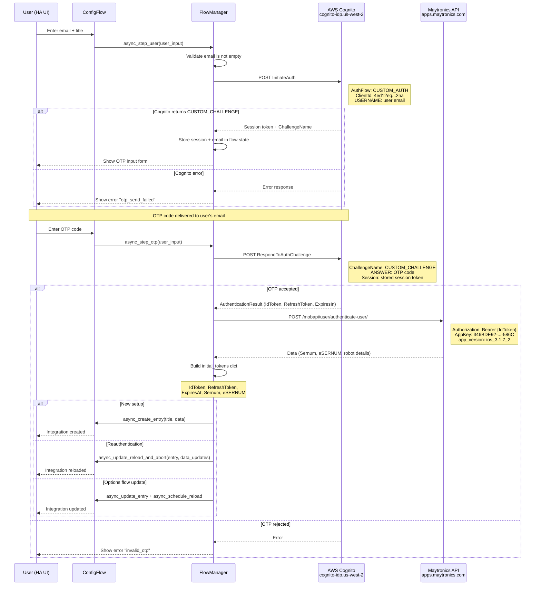
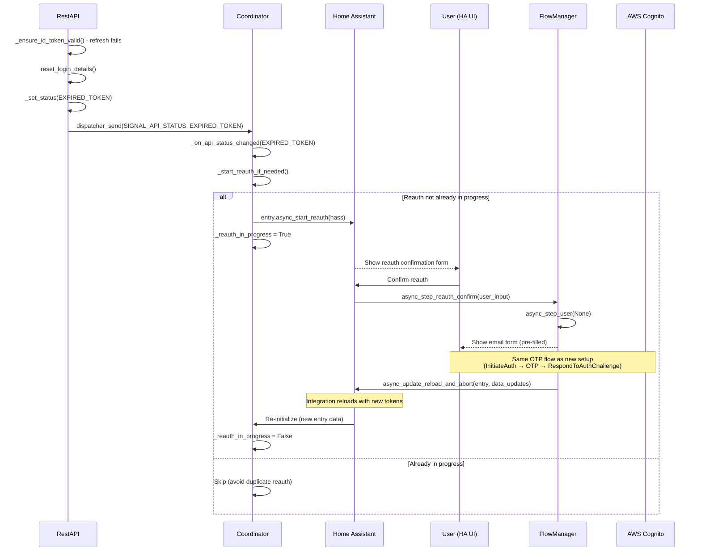

# 1. Set Up New Integration (OTP Flow)

The integration uses **AWS Cognito Custom Auth** with OTP delivered to the user's email. No password is stored — only tokens are persisted.

> **Note**: This document contains Mermaid diagrams. To view them properly:
>
> - On GitHub: Diagrams render automatically
> - In VS Code/Cursor: Install the "Markdown Preview Mermaid Support" extension

---

## Endpoints

| Step         | URL                                                          | Method | Purpose                              |
| ------------ | ------------------------------------------------------------ | ------ | ------------------------------------ |
| Initiate OTP | `https://cognito-idp.us-west-2.amazonaws.com/`               | POST   | Cognito `InitiateAuth` (CUSTOM_AUTH) |
| Submit OTP   | `https://cognito-idp.us-west-2.amazonaws.com/`               | POST   | Cognito `RespondToAuthChallenge`     |
| Get Profile  | `https://apps.maytronics.com/mobapi/user/authenticate-user/` | POST   | Returns serial numbers for robot     |

---

## Sequence Diagram — New Integration Setup

---

## Key Parameters

| Parameter        | Value                                  |
| ---------------- | -------------------------------------- |
| Cognito ClientId | `4ed12eq01o6n0tl5f0sqmkq2na`           |
| Auth Flow        | `CUSTOM_AUTH`                          |
| Challenge Name   | `CUSTOM_CHALLENGE`                     |
| AppKey header    | `346BDE92-53D1-4829-8A2E-B496014B586C` |
| App Version      | `ios_3.1.7_2`                          |

---

## Sequence Diagram — Reauthentication

When the refresh token expires or is rejected, the coordinator triggers HA's reauth flow which re-runs the same OTP sequence.

---

## Source Code

| Module                     | Responsibility                                                                                    |
| -------------------------- | ------------------------------------------------------------------------------------------------- |
| `managers/flow_manager.py` | `IntegrationFlowManager` — orchestrates `async_step_user` (email) and `async_step_otp` (code)     |
| `managers/rest_api.py`     | `cognito_initiate_auth()`, `cognito_respond_otp()`, `fetch_user_profile()` — standalone functions |
| `config_flow.py`           | HA config flow entry points: `async_step_user`, `async_step_otp`, `async_step_reauth`             |
