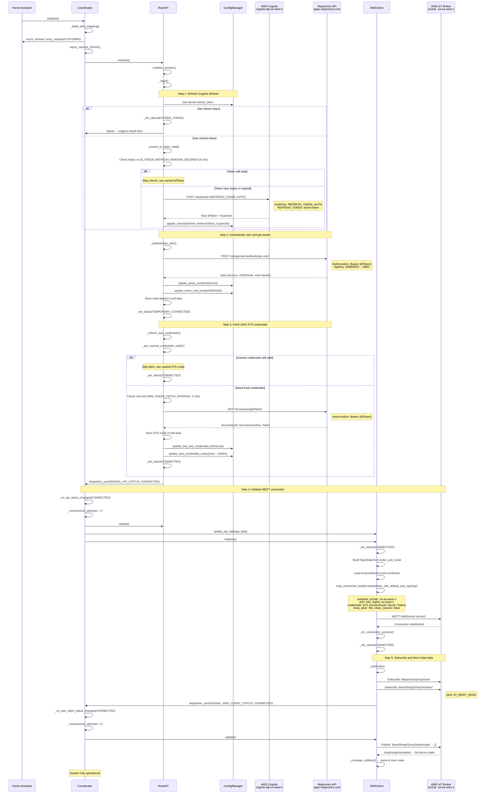
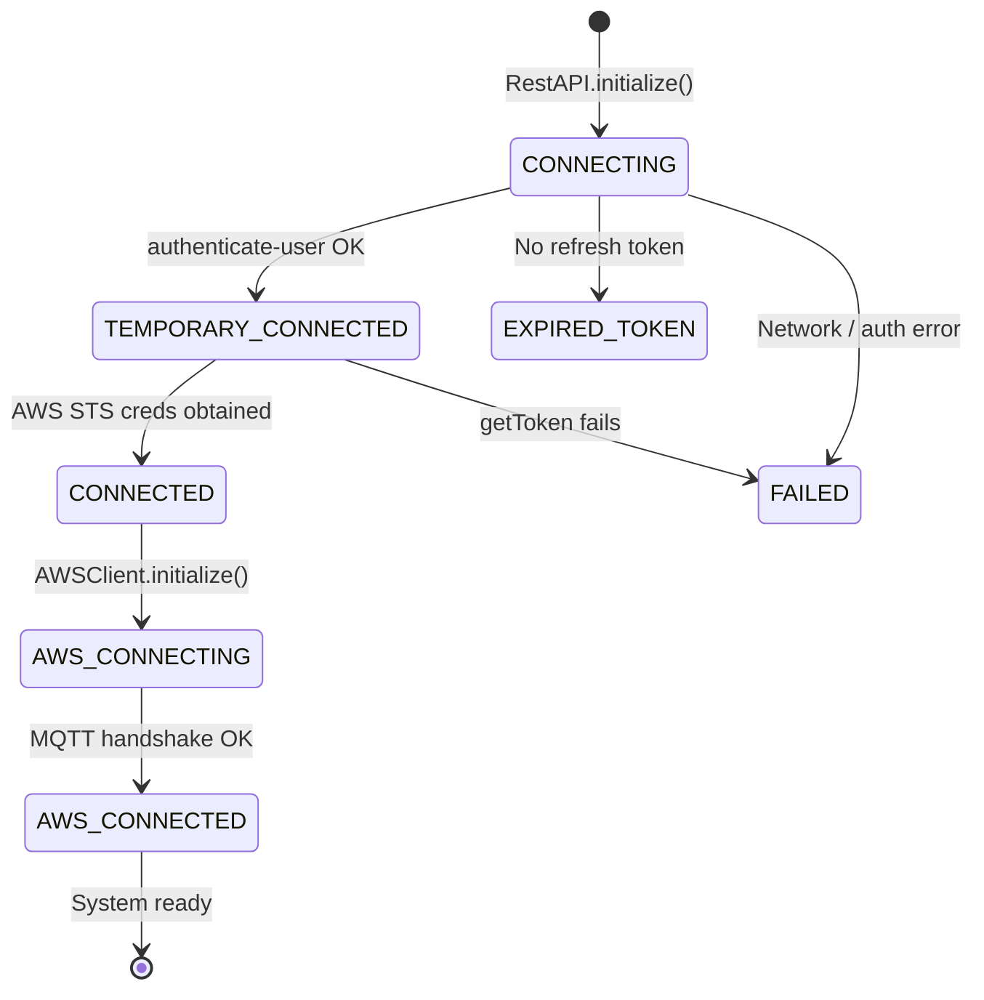

# 2. Integration Startup

On load, the coordinator initializes the REST API (token refresh + profile), fetches AWS IoT credentials, then connects the MQTT client.

> **Note**: This document contains Mermaid diagrams. To view them properly:
>
> - On GitHub: Diagrams render automatically
> - In VS Code/Cursor: Install the "Markdown Preview Mermaid Support" extension

---

## Endpoints (in order)

| #   | URL                                                          | Purpose                                                     |
| --- | ------------------------------------------------------------ | ----------------------------------------------------------- |
| 1   | `https://cognito-idp.us-west-2.amazonaws.com/`               | Refresh IdToken via `REFRESH_TOKEN_AUTH` flow               |
| 2   | `https://apps.maytronics.com/mobapi/user/authenticate-user/` | Validate token, get serial numbers                          |
| 3   | `https://apps.maytronics.com/mt-sso/aws/getToken/`           | Fetch STS credentials (AccessKeyId, SecretAccessKey, Token) |
| 4   | `wss://a12rqfdx55bdbv-ats.iot.eu-west-1.amazonaws.com:443`   | MQTT over WebSocket (AWS IoT Core)                          |

---

## Sequence Diagram — Full Startup

---

## AWS IoT Connection Parameters

| Parameter     | Value                                                 |
| ------------- | ----------------------------------------------------- |
| Endpoint      | `a12rqfdx55bdbv-ats.iot.eu-west-1.amazonaws.com`      |
| Port          | `443`                                                 |
| Region        | `eu-west-1`                                           |
| Protocol      | MQTT over WebSocket (`wss://`)                        |
| Auth          | AWS STS credentials (IAM)                             |
| Keep-alive    | 30 seconds                                            |
| Clean session | `false`                                               |
| CA cert       | `AmazonRootCA.pem` (bundled in `managers/` directory) |

---

## Status Transitions During Startup

---

## Credential Caching

AWS STS credentials are cached to reduce API calls:

| Setting                | Value                   | Constant                          |
| ---------------------- | ----------------------- | --------------------------------- |
| Credential TTL         | 1 hour 50 minutes       | `AWS_CREDENTIALS_TTL`             |
| Min fetch interval     | 5 minutes               | `MIN_TOKEN_FETCH_INTERVAL`        |
| IdToken refresh window | 5 minutes before expiry | `ID_TOKEN_REFRESH_WINDOW_SECONDS` |

On startup, if cached credentials are still valid (checked via `_are_cached_credentials_valid()`), the STS fetch is skipped entirely.

---

## Source Code

| Module                       | Responsibility                                                                                  |
| ---------------------------- | ----------------------------------------------------------------------------------------------- |
| `managers/coordinator.py`    | `initialize()` — sets up platforms, triggers `RestAPI.initialize()`                             |
| `managers/rest_api.py`       | `_login()` → `_ensure_id_token_valid()` → `_authenticate_user()` → `_refresh_aws_credentials()` |
| `managers/aws_client.py`     | `initialize()` — builds MQTT client, connects, subscribes                                       |
| `managers/config_manager.py` | Reads/writes tokens and credentials to HA storage                                               |
| `common/consts.py`           | All endpoint URLs, timing constants, header values                                              |
