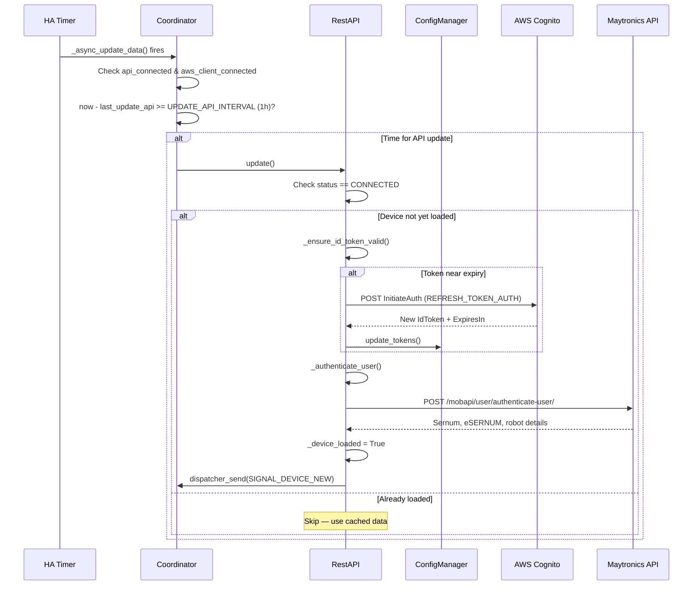
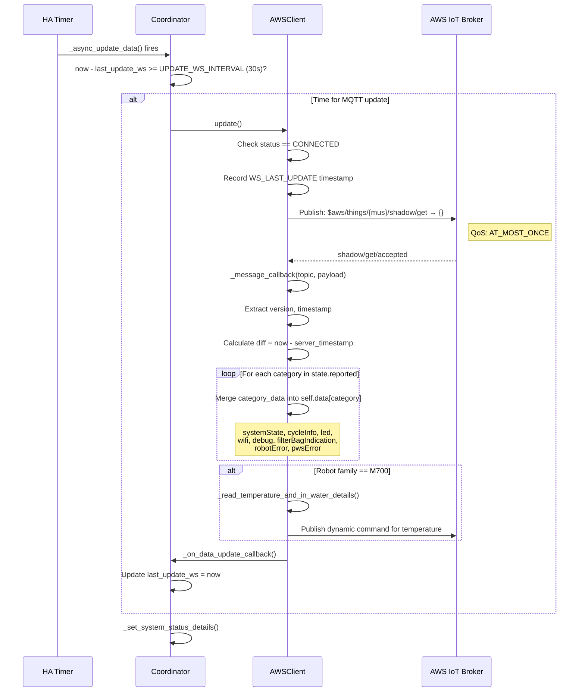
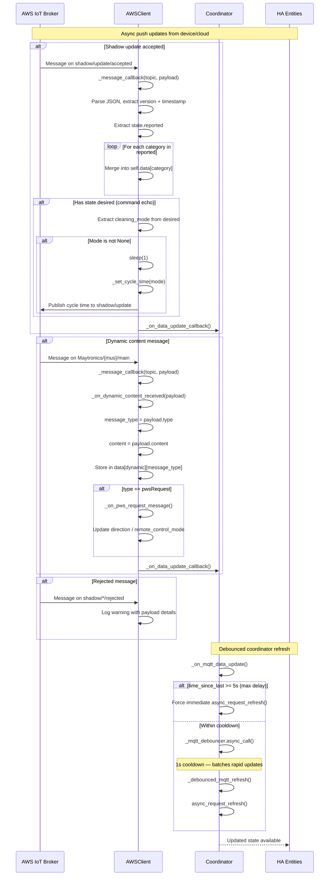

# 3. Ongoing API Calls & Event Handling

Two communication planes operate in parallel: periodic REST calls for token/profile refresh, and persistent MQTT for real-time robot state.

> **Note**: This document contains Mermaid diagrams. To view them properly:
>
> - On GitHub: Diagrams render automatically
> - In VS Code/Cursor: Install the "Markdown Preview Mermaid Support" extension

---

## Periodic REST Calls

| Call                  | URL                                                          | Interval                           | Trigger                                            |
| --------------------- | ------------------------------------------------------------ | ---------------------------------- | -------------------------------------------------- |
| authenticate-user     | `https://apps.maytronics.com/mobapi/user/authenticate-user/` | 1 hour                             | `UPDATE_API_INTERVAL` timer                        |
| Cognito token refresh | `https://cognito-idp.us-west-2.amazonaws.com/`               | Before expiry (5 min window)       | `ID_TOKEN_REFRESH_WINDOW_SECONDS`                  |
| AWS STS getToken      | `https://apps.maytronics.com/mt-sso/aws/getToken/`           | 1h50m TTL / min 5min between calls | `AWS_CREDENTIALS_TTL` / `MIN_TOKEN_FETCH_INTERVAL` |

---

## MQTT Topics — Subscribe

| Topic Pattern                | Resolves To                    | Purpose                                             |
| ---------------------------- | ------------------------------ | --------------------------------------------------- |
| `$aws/things/{mus}/shadow/#` | `.../shadow/get/accepted`      | Device shadow: full state                           |
|                              | `.../shadow/update/accepted`   | Shadow update confirmations                         |
|                              | `.../shadow/get/rejected`      | Shadow get rejections                               |
|                              | `.../shadow/update/rejected`   | Shadow update rejections                            |
| `Maytronics/{mus}/main`      | `Maytronics/MOTOR_SERIAL/main` | Dynamic messages: joystick, temperature, pwsRequest |

> **Note:** `{mus}` = motor unit serial number, obtained during authentication.

---

## MQTT Topics — Publish

| Topic                             | Payload Example                                      | Purpose                                                       |
| --------------------------------- | ---------------------------------------------------- | ------------------------------------------------------------- |
| `$aws/things/{mus}/shadow/get`    | `{}`                                                 | Request full shadow state (triggers `/get/accepted` response) |
| `$aws/things/{mus}/shadow/update` | `{"state":{"desired":{...}}}`                        | Send commands: cleaning mode, LED, pause, schedule            |
| `Maytronics/{mus}/main`           | `{"type":"pwsRequest","description":"joystick",...}` | Dynamic commands: joystick control, temperature read          |

---

## Sequence Diagram — Periodic REST Refresh



---

## Sequence Diagram — Periodic MQTT Shadow Poll



---

## Sequence Diagram — Real-time MQTT Push Updates



---

## Shadow Message Structure

Shadow `get/accepted` messages follow the AWS IoT Device Shadow format:

```json
{
  "state": {
    "reported": {
      "systemState": {
        "pwsState": 1,
        "robotState": 1,
        "robotType": "...",
        "isBusy": false
      },
      "cycleInfo": { "cleaningMode": { "mode": "all" }, "cycleTime": 120 },
      "led": { "ledMode": "1", "ledIntensity": 80, "ledEnable": false },
      "filterBagIndication": { "state": 0, "resetFBI": false },
      "debug": { "WIFI_RSSI": -45 },
      "wifi": { "netName": "MyNetwork" }
    }
  },
  "version": 1234,
  "timestamp": 1715680000
}
```

---

## Dynamic Message Structure

Messages on `Maytronics/{mus}/main`:

```json
{
  "type": "pwsRequest",
  "description": "joystick",
  "content": {
    "speed": 50,
    "direction": "forward"
  }
}
```

Dynamic message types handled:

- `pwsRequest` — Joystick direction and remote control mode changes
- `iotResponse` — Temperature readings (M700 family)

---

## Publish Commands (desired state)

Commands are sent by publishing to the shadow `update` topic with a `desired` state:

| Command                | Desired Payload                                                    | Function                   |
| ---------------------- | ------------------------------------------------------------------ | -------------------------- |
| Set cleaning mode      | `{"cleaningMode": {"mode": "all"}}`                                | `set_cleaning_mode()`      |
| Set cycle time         | `{"cycleInfo": {"cycleTime": 120}}`                                | `_set_cycle_time()`        |
| Set LED mode           | `{"led": {"ledMode": "2", "ledIntensity": 80, "ledEnable": true}}` | `set_led_mode()`           |
| Pause robot            | `{"systemState": {"pwsState": 0}}`                                 | `pause()`                  |
| Pickup (return home)   | Sets cleaning mode to PICKUP                                       | `pickup()`                 |
| Reset filter indicator | `{"filterBagIndication": {"resetFbi": true}}`                      | `reset_filter_indicator()` |

---

## Update Intervals

| Interval              | Value      | Purpose                                       |
| --------------------- | ---------- | --------------------------------------------- |
| `UPDATE_WS_INTERVAL`  | 30 seconds | Periodic MQTT shadow get poll                 |
| `UPDATE_API_INTERVAL` | 1 hour     | REST profile refresh                          |
| Debounce cooldown     | 1 second   | MQTT callback → coordinator refresh           |
| Max MQTT delay        | 5 seconds  | Safety net: force refresh if debouncer stalls |

---

## Source Code

| Module                    | Responsibility                                                                                           |
| ------------------------- | -------------------------------------------------------------------------------------------------------- |
| `managers/aws_client.py`  | `_message_callback()` — routes messages; `_publish()` — sends commands; `update()` — periodic shadow get |
| `managers/coordinator.py` | `_async_update_data()` — periodic refresh; `_on_mqtt_data_update()` — debounced MQTT callback            |
| `managers/rest_api.py`    | `update()` — periodic authenticate-user; `_ensure_id_token_valid()` — token refresh                      |
| `models/topic_data.py`    | `TopicData` — constructs all topic strings from motor unit serial                                        |
