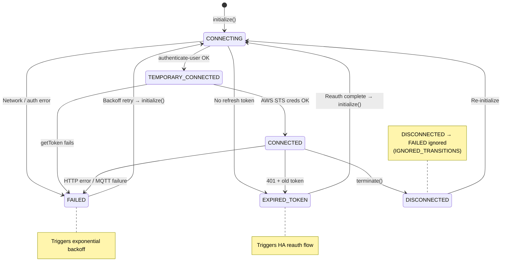
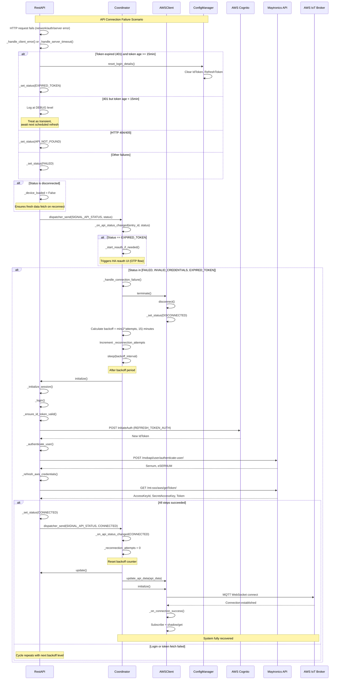
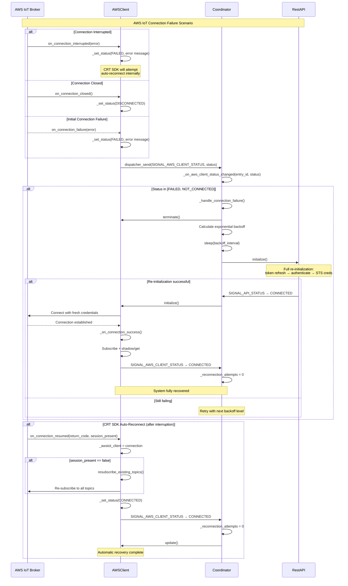
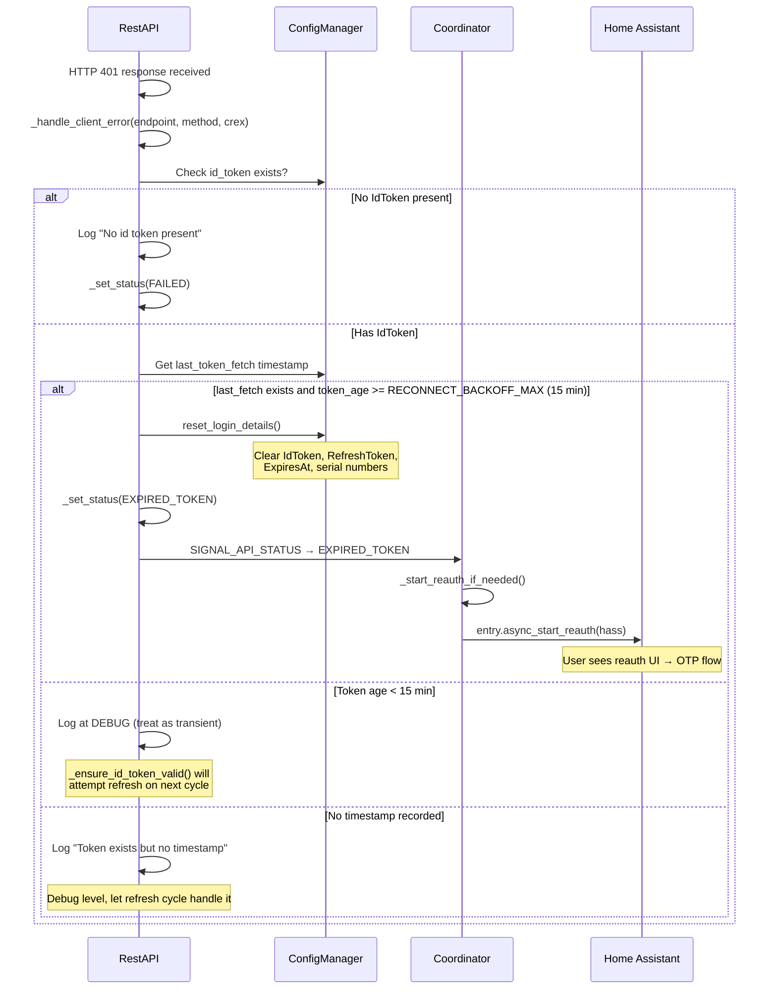

# 4. Connection Error Recovery

Recovery operates at two levels: the AWS CRT SDK handles transient MQTT reconnection automatically; the coordinator handles higher-level failures with exponential backoff.

> **Note**: This document contains Mermaid diagrams. To view them properly:
>
> - On GitHub: Diagrams render automatically
> - In VS Code/Cursor: Install the "Markdown Preview Mermaid Support" extension

---

## Status Values

| Status                | Meaning                             | Triggers                                  |
| --------------------- | ----------------------------------- | ----------------------------------------- |
| `CONNECTING`          | Establishing connection             | `initialize()` called                     |
| `TEMPORARY_CONNECTED` | REST login done, awaiting AWS creds | `authenticate-user` succeeded             |
| `CONNECTED`           | Fully operational                   | AWS credentials obtained / MQTT connected |
| `FAILED`              | Error occurred                      | HTTP error, MQTT failure, timeout         |
| `EXPIRED_TOKEN`       | Token rejected/expired              | 401 response, refresh failure             |
| `DISCONNECTED`        | Graceful shutdown                   | `terminate()` or connection closed        |
| `INVALID_CREDENTIALS` | Bad credentials                     | Authentication rejected                   |
| `API_NOT_FOUND`       | Endpoint missing                    | HTTP 404/405 response                     |

---

## State Diagram — Connectivity Status



---

## Sequence Diagram — API Disconnection & Recovery



---

## Sequence Diagram — AWS IoT MQTT Disconnection & Recovery



---

## Exponential Backoff

| Attempt | Wait Time        | Formula                           |
| ------- | ---------------- | --------------------------------- |
| 1       | 1 minute         | 2^0 = 1                           |
| 2       | 2 minutes        | 2^1 = 2                           |
| 3       | 4 minutes        | 2^2 = 4                           |
| 4       | 8 minutes        | 2^3 = 8                           |
| 5+      | 15 minutes (max) | capped by `RECONNECT_BACKOFF_MAX` |

The counter (`_reconnection_attempts`) resets to 0 on any successful connection (either API or AWS client reaching `CONNECTED` status).

---

## Sequence Diagram — Token Expiry / 401 Handling



---

## Rate Limiting

AWS credential fetches are rate-limited to prevent hammering the Maytronics API:

| Setting                    | Value             | Purpose                                                       |
| -------------------------- | ----------------- | ------------------------------------------------------------- |
| `MIN_TOKEN_FETCH_INTERVAL` | 5 minutes         | Minimum time between `getToken` calls                         |
| `AWS_CREDENTIALS_TTL`      | 1 hour 50 minutes | Cache validity (AWS tokens valid for 2h, 10min safety margin) |

**Behavior when rate-limited:**

1. If cached credentials are still valid → use them
2. If cached credentials expired and rate-limited → status `FAILED` (wait for cooldown)
3. If no cache at all → attempt fetch despite rate limit (best effort)

---

## Ignored Status Transitions

To prevent status thrashing, certain transitions are suppressed:

```python
IGNORED_TRANSITIONS = {ConnectivityStatus.DISCONNECTED: [ConnectivityStatus.FAILED]}
```

When the system is already `DISCONNECTED`, a transition to `FAILED` is ignored — the system is already shutting down.

---

## Coordinator Signal Handling Summary

### API Status Changes (`SIGNAL_API_STATUS`)

| Status                | Coordinator Action                                                                                  |
| --------------------- | --------------------------------------------------------------------------------------------------- |
| `CONNECTED`           | Reset backoff counter, call `api.update()`, pass data to AWS client, call `aws_client.initialize()` |
| `FAILED`              | Trigger `_handle_connection_failure()` (backoff + retry)                                            |
| `INVALID_CREDENTIALS` | Trigger `_handle_connection_failure()`                                                              |
| `EXPIRED_TOKEN`       | Start HA reauth flow + trigger `_handle_connection_failure()`                                       |

### AWS Client Status Changes (`SIGNAL_AWS_CLIENT_STATUS`)

| Status          | Coordinator Action                                                     |
| --------------- | ---------------------------------------------------------------------- |
| `CONNECTED`     | Reset backoff counter, call `aws_client.update()` (initial shadow get) |
| `FAILED`        | Trigger `_handle_connection_failure()`                                 |
| `NOT_CONNECTED` | Trigger `_handle_connection_failure()`                                 |

---

## Source Code

| Module                          | Responsibility                                                                                                                   |
| ------------------------------- | -------------------------------------------------------------------------------------------------------------------------------- |
| `managers/coordinator.py`       | `_handle_connection_failure()` — backoff logic; `_on_api_status_changed()` / `_on_aws_client_status_changed()` — signal handlers |
| `managers/rest_api.py`          | `_handle_client_error()` — 401/404 handling; `_set_status()` — dispatches `SIGNAL_API_STATUS`                                    |
| `managers/aws_client.py`        | `_on_connection_*()` callbacks — MQTT lifecycle; `_set_status()` — dispatches `SIGNAL_AWS_CLIENT_STATUS`                         |
| `common/connectivity_status.py` | `ConnectivityStatus` enum, `IGNORED_TRANSITIONS` map                                                                             |
