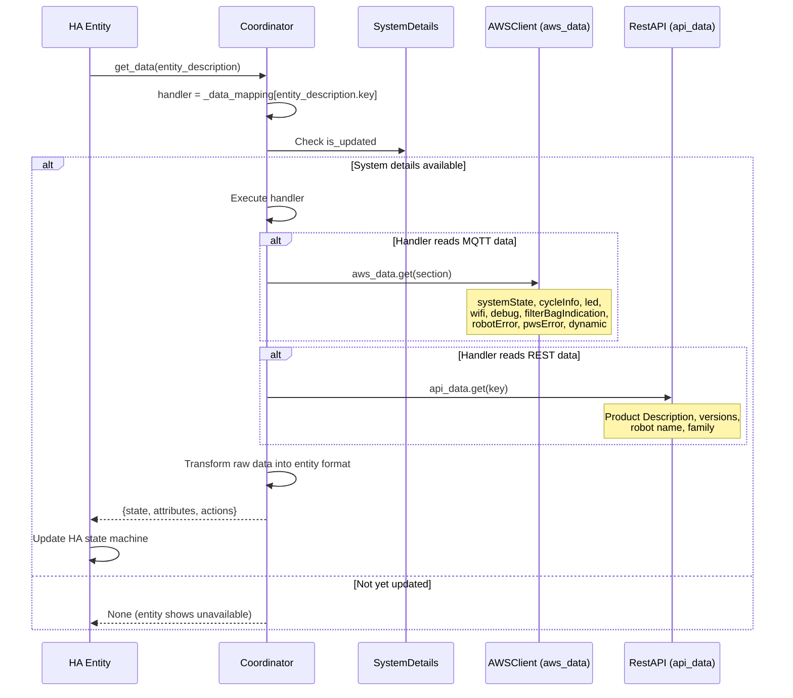
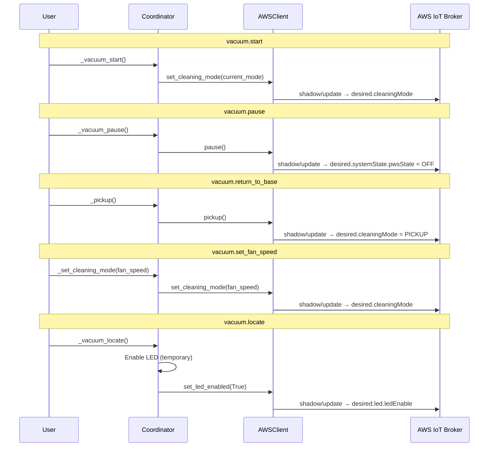
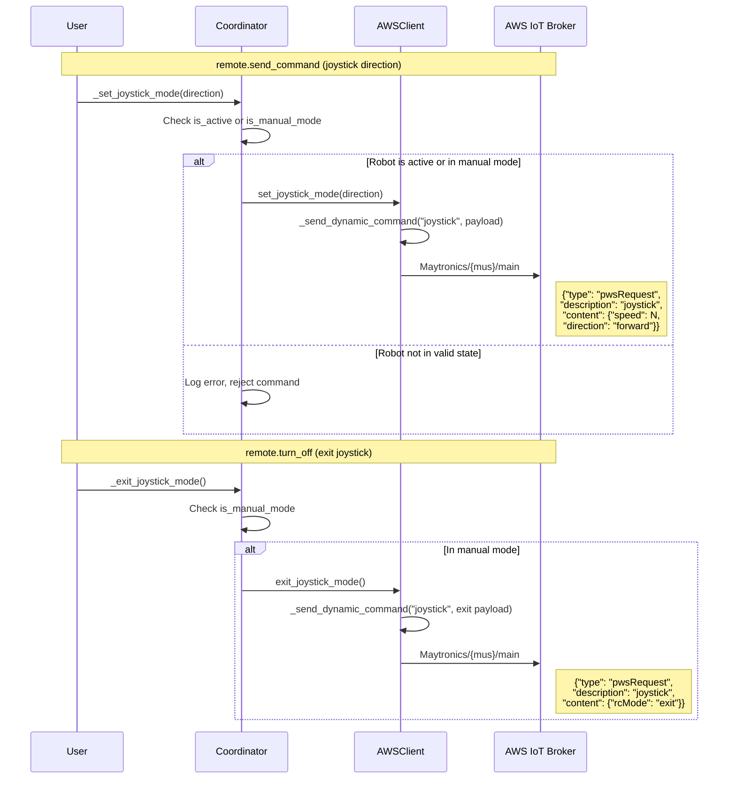

# 5. Entity Data Retrieval & User Actions

This section covers the "last mile" — how HA entities consume Maytronics data and how user actions from dashboards, automations, and voice assistants travel back to the robot via MQTT.

> **Note**: This document contains Mermaid diagrams. To view them properly:
>
> - On GitHub: Diagrams render automatically
> - In VS Code/Cursor: Install the "Markdown Preview Mermaid Support" extension

---

## Entity Data Flow

Every HA entity (vacuum, sensor, light, etc.) retrieves its state through the coordinator's data-mapping pattern. The coordinator acts as a single gateway between raw API/MQTT data and the entity layer.



---

## Data Mapping

The coordinator builds a mapping from entity keys to handler functions at initialization. Each handler knows which data source to read (MQTT shadow, REST profile, or computed `SystemDetails`).

| Entity Key            | Handler                           | Data Source                          | Returns                                  |
| --------------------- | --------------------------------- | ------------------------------------ | ---------------------------------------- |
| `status`              | `_get_status_data`                | SystemDetails (computed)             | Calculated state + all system attributes |
| `vacuum`              | `_get_vacuum_data`                | aws_data (cycleInfo) + SystemDetails | Vacuum state + mode + action callbacks   |
| `remote`              | `_get_remote_data`                | SystemDetails                        | Manual mode state + joystick actions     |
| `clean_mode`          | `_get_clean_mode_data`            | aws_data (cycleInfo)                 | Current cleaning mode                    |
| `led`                 | `_get_led_data`                   | aws_data (led)                       | LED on/off + toggle actions              |
| `led_mode`            | `_get_led_mode_data`              | aws_data (led)                       | LED pattern + select action              |
| `led_intensity`       | `_get_led_intensity_data`         | aws_data (led)                       | Brightness value + set action            |
| `filter_status`       | `_get_filter_status_data`         | aws_data (filterBagIndication)       | Filter bag level + icon                  |
| `cycle_time`          | `_get_cycle_time_data`            | aws_data (cycleInfo)                 | Duration + start time                    |
| `cycle_time_left`     | `_get_cycle_time_left_data`       | aws_data (cycleInfo) + SystemDetails | Remaining seconds + end time             |
| `rssi`                | `_get_rssi_data`                  | aws_data (debug)                     | WiFi signal strength                     |
| `network_name`        | `_get_network_name_data`          | aws_data (wifi)                      | Connected network name                   |
| `power_supply_status` | `_get_power_supply_status_data`   | SystemDetails                        | Power unit state                         |
| `robot_status`        | `_get_robot_status_data`          | SystemDetails                        | Robot state                              |
| `robot_type`          | `_get_robot_type_data`            | SystemDetails                        | Robot type identifier                    |
| `busy`                | `_get_busy_data`                  | SystemDetails                        | Is robot busy (binary)                   |
| `cycle_count`         | `_get_cycle_count_data`           | SystemDetails                        | Turn-on count                            |
| `aws_broker`          | `_get_aws_broker_data`            | AWSClient status                     | MQTT connection status (binary)          |
| `robot_error`         | `_get_robot_error_data`           | aws_data (robotError)                | Error code (current cycle)               |
| `power_supply_error`  | `_get_pws_error_data`             | aws_data (pwsError)                  | PSU error code                           |
| `battery`             | `_get_battery_data`               | Hardcoded                            | Always 100% (pool robots are wired)      |
| `temperature`         | `_get_temperature_data`           | aws_data (dynamic/iotResponse)       | Water temperature (M700 only)            |
| `cycle_time_*`        | `_get_clean_mode_cycle_time_data` | ConfigManager                        | Per-mode cycle time + set action         |

---

## Handler Return Shape

Every handler returns a dictionary with a consistent structure:

```python
{
    "state": <value>,               # Entity state (string, number, bool)
    "attributes": { ... },          # Extra attributes for HA state
    "is_on": <bool>,                # For binary sensors / switches
    "icon": "mdi:...",              # Dynamic icon (optional)
    "actions": {                    # Action callbacks (optional, for controllable entities)
        "start": <async_callable>,
        "pause": <async_callable>,
        ...
    }
}
```

---

## User Action Dispatch

When a user triggers an action (e.g. starts the vacuum from the dashboard), the call flows from the entity through the coordinator to the MQTT layer.

```mermaid
sequenceDiagram
    participant User as User / Automation
    participant Entity as HA Entity
    participant Coord as Coordinator
    participant AWS as AWSClient
    participant Broker as AWS IoT Broker

    User->>Entity: Call service (e.g. vacuum.start)
    Entity->>Coord: get_device_action(entity_description, SERVICE_START)

    Coord->>Coord: get_data(entity_description)
    Coord->>Coord: actions = result[ATTR_ACTIONS]
    Coord-->>Entity: Return async callable (_vacuum_start)

    Entity->>Coord: Execute _vacuum_start()

    Coord->>Coord: Get current mode from aws_data
    Coord->>AWS: set_cleaning_mode(mode)

    AWS->>AWS: _send_desired_command(payload)
    Note over AWS: payload = {"state": {"desired":<br/>{"cleaningMode": {"mode": "all"}}}}

    AWS->>AWS: _publish(topic_data.update, data)
    AWS->>Broker: Publish to $aws/things/{mus}/shadow/update
    Note right of Broker: QoS: AT_MOST_ONCE

    Broker-->>AWS: Publish acknowledged
    Broker->>Broker: Apply desired state to shadow
    Broker->>AWS: Push shadow/update/accepted
    AWS->>AWS: _message_callback() → update local data
    AWS->>Coord: _on_data_update_callback()
    Coord->>Coord: Debounced refresh → entities update

    Note over Entity: Next refresh shows updated state
```



---

## Available User Actions

### Vacuum Actions



### LED Actions

| HA Service                     | Coordinator Method        | AWSClient Method         | MQTT Payload (desired)               |
| ------------------------------ | ------------------------- | ------------------------ | ------------------------------------ |
| `light.turn_on`                | `_set_led_enabled()`      | `set_led_enabled(True)`  | `{"led": {"ledEnable": true, ...}}`  |
| `light.turn_off`               | `_set_led_disabled()`     | `set_led_enabled(False)` | `{"led": {"ledEnable": false, ...}}` |
| `select.select_option` (mode)  | `_set_led_mode(option)`   | `set_led_mode(int)`      | `{"led": {"ledMode": "2", ...}}`     |
| `number.set_value` (intensity) | `_set_led_intensity(val)` | `set_led_intensity(int)` | `{"led": {"ledIntensity": 80, ...}}` |

### Remote Control (Joystick) Actions



### Other Actions

| HA Service              | Coordinator Method                  | AWSClient Method           | MQTT Topic      | Payload                                                |
| ----------------------- | ----------------------------------- | -------------------------- | --------------- | ------------------------------------------------------ |
| Reset filter indicator  | (service call)                      | `reset_filter_indicator()` | `shadow/update` | `{"filterBagIndication": {"resetFbi": true}}`          |
| Set cycle time per mode | `_set_clean_mode_cycle_time_data()` | (config only)              | N/A             | Stored in ConfigManager, published on next mode change |

---

## Command Types

Commands fall into two categories based on how they reach the robot:

### Desired State Commands (persistent)

Published to `$aws/things/{mus}/shadow/update` with a `{"state": {"desired": {...}}}` wrapper. These update the device shadow and persist until the robot acknowledges them.

- Cleaning mode
- LED settings (mode, intensity, enable)
- System state (pause via pwsState)
- Schedule configuration
- Cycle time
- Filter bag indicator reset

### Dynamic Commands (transient)

Published directly to `Maytronics/{mus}/main` without a shadow wrapper. These are immediate, non-persistent commands.

- Joystick direction control
- Exit joystick mode
- Temperature read request (M700)

---

## Source Code

| Module                                                                                          | Responsibility                                                                                                                                                                              |
| ----------------------------------------------------------------------------------------------- | ------------------------------------------------------------------------------------------------------------------------------------------------------------------------------------------- |
| `managers/coordinator.py`                                                                       | `_build_data_mapping()` — registers all handlers; `get_data()` / `get_device_action()` — entity interface; `_vacuum_start()`, `_set_led_*()`, `_set_joystick_mode()`, etc. — action methods |
| `managers/aws_client.py`                                                                        | `set_cleaning_mode()`, `set_led_*()`, `set_joystick_mode()`, `pause()`, `pickup()` — translate actions to MQTT publishes via `_send_desired_command()` or `_send_dynamic_command()`         |
| `common/entity_descriptions.py`                                                                 | Entity description definitions with keys that map into `_data_mapping`                                                                                                                      |
| `vacuum.py`, `light.py`, `select.py`, `number.py`, `remote.py`, `sensor.py`, `binary_sensor.py` | Platform entities that call `coordinator.get_data()` and `coordinator.get_device_action()`                                                                                                  |
